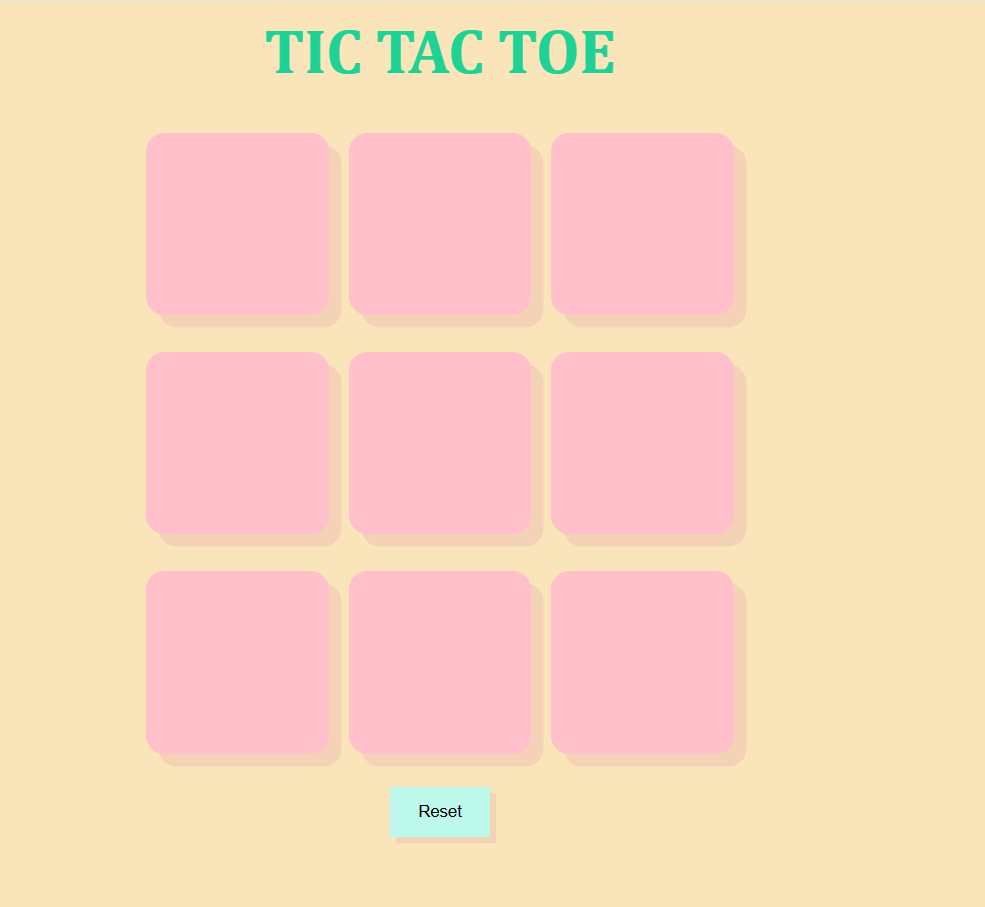
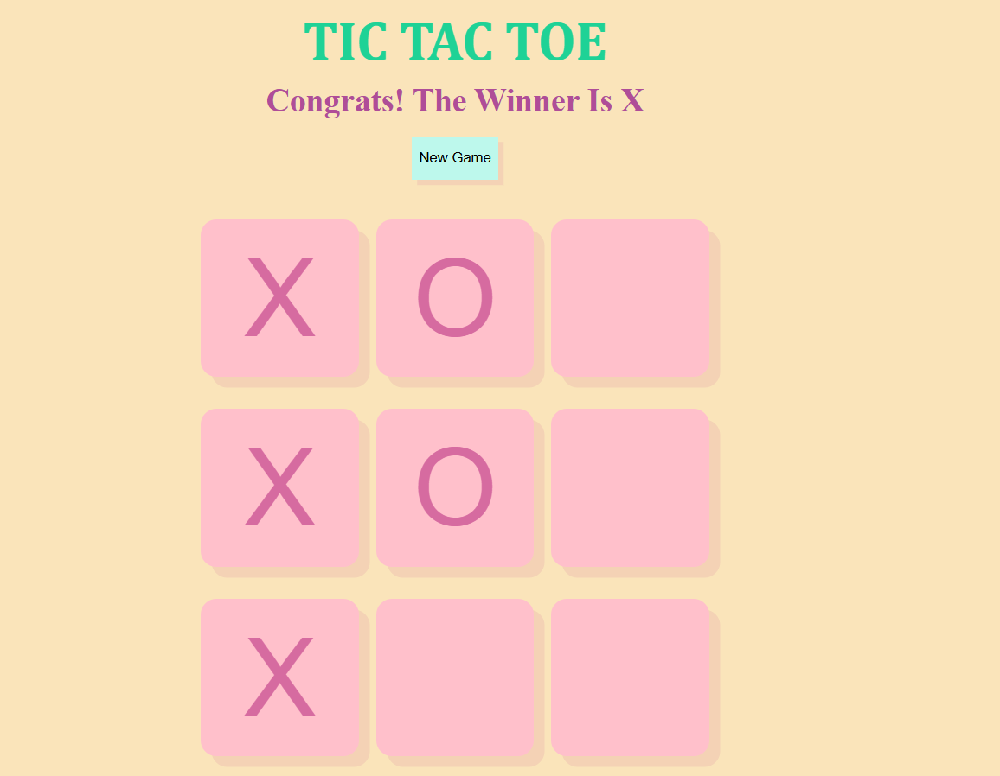
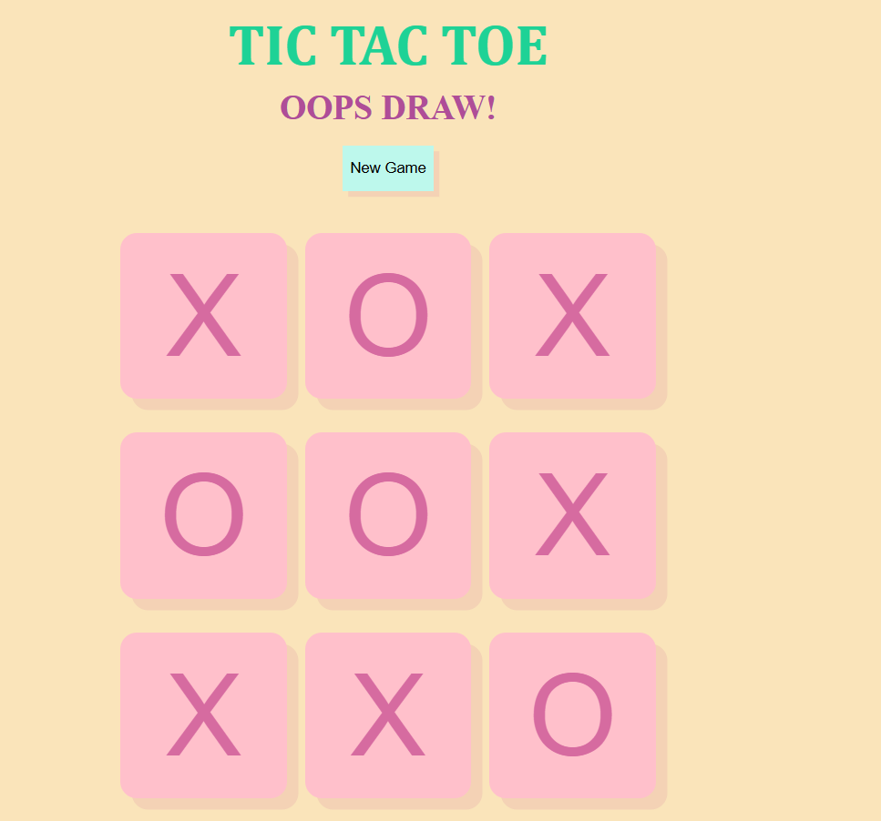

# 🎮 Tic Tac Toe Game

A simple and fun **Tic Tac Toe** game built using **HTML**, **CSS**, and **JavaScript**. Play against a friend on the same device!

## 🛠️ Built With

- HTML
- CSS
- JavaScript

## ✨ Features

- 2-player gameplay
- Interactive UI with winning highlight
- Game reset option
- Basic game logic to check win/draw

## Screenshots
 <br>
 <br>
 <br>

## 🚀 Getting Started

To play the game locally:

1. Download or clone the repository:
   ```bash
   git clone https://github.com/TejasviBabar/TIC-TAC-TOE.git
